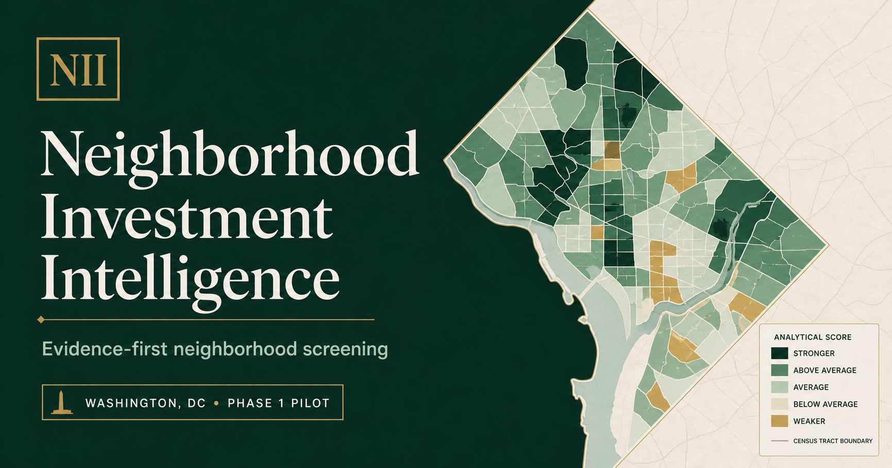
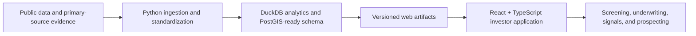

# Neighborhood Investment Intelligence

An evidence-first real-estate market intelligence platform that combines a reproducible public-data pipeline with an investor-facing web application.

[View the live application](https://neighborhood-investment-intelligence.omi123.chatgpt.site/)



## What it demonstrates

- A map-based opportunity screener covering 2,072 census tracts across nine initial city markets.
- Comparable value, momentum, demographic, housing, and risk indicators with visible source years and confidence.
- An all-market Property Universe with public parcel records, recent-sale context, prospecting lists, and a path to licensed listing feeds.
- Property underwriting with quick and detailed analysis, sensitivity testing, NOI, DSCR, NPV, and return metrics.
- City signals for migration, regulation, taxation, public investment, and evidence-backed private development.
- Watchlists, alerts, saved analyses, source lineage, and data-health views.

## Architecture



| Layer | Technologies |
| --- | --- |
| Data engineering | Python, pandas, PyArrow, DuckDB, HTTPX, Pydantic |
| Geospatial | GeoPandas, Shapely, TIGER/Line geometries, PostGIS-ready migrations |
| Web application | React, TypeScript, Vinext/Vite, Tailwind CSS |
| Persistence | Drizzle ORM, Cloudflare D1/Workers-compatible APIs |
| Quality | pytest, Node test runner, ESLint, GitHub Actions |

## Repository guide

| Path | Purpose |
| --- | --- |
| `src/neighborhood_intelligence/` | Ingestion, normalization, scoring, forecasting, and export logic |
| `config/` | Source registry, metrics, geographies, and scoring configuration |
| `migrations/` | Analytical and application database schemas |
| `reference/` | Curated public reference records and evidence inputs |
| `tests/` | Pipeline and data-contract tests |
| `web/` | Investor-facing web application, APIs, and generated public artifacts |
| `docs/` | Architecture, methods, data contracts, operations, and phase notes |

## Run the web application

Requirements: Node.js 22.13 or newer and pnpm 10.

```powershell
cd web
corepack enable
pnpm install --frozen-lockfile
pnpm run dev
```

The checked-in public artifacts support local exploration without rebuilding the warehouse. Persistent watchlists, saves, and alerts require the configured application database in a hosted environment.

## Run the data pipeline

Requirements: Python 3.11 or 3.12.

```powershell
python -m venv .venv
.\.venv\Scripts\Activate.ps1
python -m pip install -e ".[geospatial]"
Copy-Item .env.example .env
nii init
nii register-sources
nii ingest-acs --state 11
nii build-profile
python -m pytest
```

Census and FBI API keys are optional for some public endpoints but improve reliability and request limits. Put them only in a local `.env` file; never commit credentials.

## Data sources

The platform is designed around public or publicly documented sources:

- U.S. Census Bureau ACS, TIGER/Line, and Building Permits Survey
- Census LEHD Origin-Destination Employment Statistics
- U.S. Bureau of Labor Statistics QCEW
- Federal Housing Finance Agency house-price indexes
- FBI Crime Data Explorer
- Federal Highway Administration National Bridge Inventory
- SEC filings, company investor-relations releases, and state/local economic-development or planning notices
- Official city and county parcel, assessment, deed, and sale APIs where available

Every displayed metric should carry a source, observation period, geography, and confidence or completeness signal. See [`docs/`](docs/) and the in-product Sources and Methodology pages for details.

## Methodology and limitations

- Census estimates have different release years and overlapping survey windows; the interface surfaces vintage rather than implying all metrics are contemporaneous.
- Scores are comparative screening tools, not appraisals, forecasts of guaranteed performance, or investment advice.
- Public parcel records describe the property universe; they are not active listings. A comprehensive active-listing marketplace requires a licensed feed.
- Project announcements remain `ANNOUNCED` until primary evidence supports a status change.
- City comparisons use consistent definitions where possible, but local parcel and regulatory fields vary by jurisdiction.

## Quality checks

```powershell
python -m pytest
cd web
pnpm run build
node --test tests/rendered-html.test.mjs
```

GitHub Actions runs the same core pipeline and web checks for pushes and pull requests.

## Codex project workflows

The repository includes project-scoped Codex guidance in `AGENTS.md`, reusable skills in `.agents/skills/`, and narrow custom agents in `.codex/agents/`. The UI workflow intentionally combines the existing semantic CSS and brand variables with selective Tailwind CSS 4 utilities; it does not require a wholesale styling rewrite. See `docs/ui-registry.md` before changing maps, layouts, controls, or responsive behavior.

## Privacy and responsible use

The project emphasizes aggregate market analysis and public property records. Do not add protected personal data, private contact details, authentication secrets, or data whose license prohibits redistribution. Users remain responsible for fair-housing, privacy, solicitation, and data-provider requirements in their jurisdiction.

## License

This repository is source-available for portfolio and evaluation purposes. See [`LICENSE`](LICENSE). Third-party data remains subject to the terms of its originating source.
