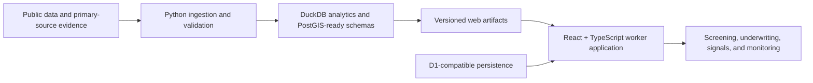

# Neighborhood Investment Intelligence

An evidence-first real-estate market intelligence platform that combines a reproducible public-data pipeline with an investor-focused web application.


## Overview

Neighborhood Investment Intelligence (NII) helps investors screen markets, investigate properties, model acquisition scenarios, and trace every material claim back to its source. The project favors explicit coverage, geography, observation dates, and confidence over unsupported rankings or fabricated completeness.

The repository contains two connected products:

- A Python pipeline for ingesting, validating, and publishing neighborhood-level fundamentals.
- A React and TypeScript application for market discovery, property research, underwriting, monitoring, and source review.

## Product capabilities

- Multi-market opportunity screening with tract-level fundamentals, momentum, housing, risk, and source-vintage context.
- A public-record Property Universe with recent-sale views, prospecting workflows, and explicit coverage gaps.
- Property underwriting with cash and debt scenarios, NOI, DSCR, NPV, IRR, sensitivity matrices, and stress tests.
- Market signals for migration, regulation, taxation, public investment, infrastructure, and evidence-backed private projects.
- Watchlists, alerts, saved searches, saved areas, saved properties, and versioned financial models when a database is configured.
- Data-health, methodology, and source-lineage surfaces that keep limitations visible.
- A reproducible fundamentals pipeline spanning ACS, LODES, QCEW, housing, public-safety, construction, infrastructure, and regulatory evidence.

## Can the website be reproduced from this repository?

Technically, yes. A fresh checkout contains the application source, frozen dependency lockfile, generated public-data artifacts, database schema and migrations, deployment configuration, and rendered-route tests needed to reproduce the visible website experience.

| Capability | What a fresh checkout provides | Additional requirement |
| --- | --- | --- |
| Market, area, signal, methodology, and underwriting views | Included source and generated artifacts | Node.js and pnpm |
| Public-record property research | Included snapshots plus bounded official public-data connectors | Internet access for live official queries |
| Saved analyses, watchlists, alerts, and user strategies | Application routes and Drizzle schema | A separate Cloudflare D1-compatible database |
| Fresh pipeline exports | Python pipeline, migrations, source registry, and tests | Source-specific API access and processing time |
| Comprehensive active listings | Integration boundaries only | A licensed listing feed and redistribution rights |
| Production hosting | Cloudflare-compatible worker output and Sites metadata | A hosting project owned by the person deploying it |

The checked-in Sites project identifier is not a shared deployment credential. Anyone deploying a copy must create and configure their own hosting project and database. No external API key is required to build or test the included web snapshot.

### Usage rights

This is a publicly viewable, source-available portfolio repository—not an open-source license grant. The current [LICENSE](LICENSE) does not grant permission to copy, modify, distribute, sublicense, sell, or use the software or bundled data without prior written permission. Third-party data remains subject to its originating source terms.

## Architecture



| Layer | Technologies |
| --- | --- |
| Data engineering | Python, pandas, PyArrow, DuckDB, HTTPX, Pydantic |
| Geospatial | GeoPandas, Shapely, TIGER/Line, PostGIS-ready migrations |
| Web application | React, TypeScript, Vinext/Vite, Tailwind CSS |
| Persistence | Drizzle ORM and Cloudflare D1-compatible APIs |
| Hosting | Cloudflare Worker-compatible output and Sites metadata |
| Quality | pytest, Node test runner, ESLint, production builds, GitHub Actions |

## Repository guide

| Path | Purpose |
| --- | --- |
| `src/neighborhood_intelligence/` | Ingestion, normalization, geography, analytics, and export logic |
| `config/` | Source registry, metrics, geographies, and runtime configuration |
| `migrations/` | DuckDB and PostgreSQL analytical schemas |
| `reference/` | Curated public reference records and evidence inputs |
| `tests/` | Pipeline and data-contract tests |
| `web/app/` | User interface, routes, APIs, and checked-in web artifacts |
| `web/db/` | Persistent application schema and database helpers |
| `web/drizzle/` | Versioned application-database migrations |
| `docs/` | Architecture, methodology, source, operations, and product documentation |
| `.agents/` and `.codex/` | Project-scoped agent guidance and review workflows |

## Reproduce the web application

Requirements:

- Node.js 22.13 or newer
- Corepack or pnpm 10.28

```powershell
git clone https://github.com/omi-swiss/neighborhood-investment-intelligence.git
cd neighborhood-investment-intelligence/web
corepack enable
pnpm install --frozen-lockfile
pnpm run dev
```

Open the local URL printed by the development server. The checked-in generated artifacts support market discovery and public-data exploration without first rebuilding the Python warehouse.

Persistent workflows require a D1-compatible database exposed through the `DB` binding. The schema is defined in `web/db/schema.ts`, and migrations are tracked in `web/drizzle/`. See [environment and integrations](web/docs/environment-and-integrations.md) for the runtime contract.

### Validate the web application

```powershell
cd web
pnpm install --frozen-lockfile
pnpm run lint
pnpm run build
node --test tests/rendered-html.test.mjs
```

The rendered test suite exercises the built worker rather than relying only on component-level mocks.

## Run the data pipeline

Requirements:

- Python 3.11 or 3.12
- `uv` recommended
- The `geospatial` extra for geometry ingestion and exports

```powershell
uv sync --all-groups --extra geospatial
uv run nii init
uv run nii register-sources
uv run nii ingest-acs --state 11
uv run nii ingest-lodes --state dc --year 2023
uv run nii build-profile
uv run nii export-profile
uv run pytest
```

District of Columbia is used as a bounded smoke run. Omit the state filter only when you intend to process every configured geography.

Load tract geometry and official Census-place and CBSA context with:

```powershell
uv run nii ingest-geography --state 11
```

Raw responses, local databases, credentials, and licensed source extracts are intentionally ignored. Store API keys only in a local `.env` file or a production secret manager.

## Data sources

The project is designed around public or publicly documented sources, including:

- U.S. Census Bureau ACS, TIGER/Line, Building Permits Survey, and LODES
- U.S. Bureau of Labor Statistics QCEW
- Federal Housing Finance Agency house-price indexes
- FBI Crime Data Explorer
- Federal Highway Administration National Bridge Inventory
- SEC filings and company investor-relations disclosures
- State and local economic-development, planning, parcel, assessment, deed, and sale records

Every published observation should retain its source, observation period, geographic resolution, retrieval lineage, and confidence or completeness signal. See [data sources](docs/data_sources.md), [geography](docs/geography.md), and [operations](docs/operations.md).

## Methodology and limitations

- ACS five-year releases have overlapping survey windows and must not be presented as independent annual observations.
- Census geography changes across vintages; trend output remains flagged when an approved normalization relationship is unavailable.
- County-native indicators are not silently down-assigned to census tracts.
- Public parcel records describe a property universe, not a comprehensive active-listing marketplace.
- Project announcements remain announcements until primary evidence supports a stronger status.
- Screening metrics and modeled returns are analytical aids, not appraisals, guarantees, or investment advice.
- Local fields and update schedules vary across jurisdictions; missing coverage remains explicit.

Detailed methodology and phase documentation is available under [`docs/`](docs/).

## Quality and responsible use

GitHub Actions installs the project from a fresh checkout and runs the Python pipeline tests, production web build, and rendered-route suite. Local checks should pass before a pull request is opened.

Do not commit:

- API keys, authentication secrets, or local environment files
- Raw source downloads or local databases
- Protected personal information or private contact details
- Licensed feeds or third-party data without redistribution permission
- Claims that exceed the source geography, observation window, or evidence status

Users remain responsible for fair-housing, privacy, solicitation, investment, and data-provider requirements in their jurisdiction. See [SECURITY.md](SECURITY.md) for vulnerability reporting and [CONTRIBUTING.md](CONTRIBUTING.md) for the development workflow.

## Project workflows

Project-specific guidance lives in [AGENTS.md](AGENTS.md), reusable skills live under [`.agents/skills/`](.agents/skills/), and narrow review agents live under [`.codex/agents/`](.codex/agents/). These workflows help preserve provenance, accessibility, evidence quality, and safe deployment practices; they do not replace human review.

## License

Copyright © 2026. All rights reserved. Review [LICENSE](LICENSE) before copying, using, or redistributing the software or bundled data.
