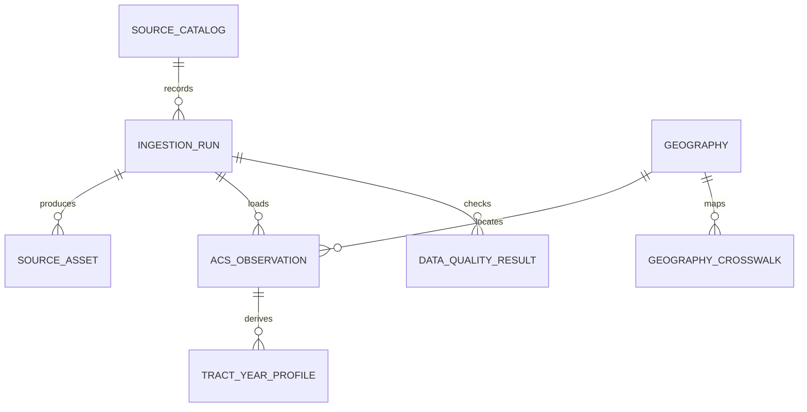

# Architecture decision

The default is a hybrid open-data architecture: the local Phase 1 runtime uses Python, DuckDB, Parquet, and append-only raw files; production promotes raw files to versioned object storage and standardized/serving data to PostgreSQL/PostGIS. This is the lowest-cost path that preserves a strong spatial database and an API/dashboard path.

| Alternative | Cost | Fit | Main limitation |
| --- | --- | --- | --- |
| Local-first DuckDB/Parquet/filesystem | Near-zero | Excellent Phase 1 research and reproducibility | Single user; no durable multi-user API or offsite recovery alone |
| Managed analytical warehouse + managed PostGIS | About $150-$600/month for a small deployment | Multi-user SLA and managed operations | Baseline spend and vendor coupling |
| Recommended hybrid object storage + PostGIS + DuckDB/Python | About $30-$150/month (local work is $0) | Small production rollout and later scale | Requires simple job/backup operations |

Raw storage is append-only and checksummed; metadata captures sources/runs/assets; Parquet is the analytical interchange; GeoPandas is only batch ingest and PostGIS performs production spatial joins; a cron/container job is sufficient initially, with Prefect deferred until backfills and cross-source dependency management justify it. FastAPI and mapping/BI are deferred until Phase 8.

## Web artifact delivery

The deployed web worker does not bundle the large tract-profile and display-geometry JSON artifacts. The build publishes them as versioned static assets, and market, map, area-detail, comparison, and tract-aware property workflows load them on demand through the worker asset binding. Small cross-site metadata remains code-native. This keeps ordinary route changes from paying the initialization cost of the full geometry while retaining the same GEOID-keyed evidence contract and release provenance.

Phase 1 sequence: migrate/register sources, smoke-test a state, ingest all states and raw evidence, load 2020 TIGER tract/place/CBSA geometry, derive centroid-based place/CBSA assignments, load an approved crosswalk, then build/export profiles. The current implementation completes the mapping step for loaded 2020-vintage tracts; 2010-vintage observations remain unmapped until crosswalk normalization is approved. It intentionally makes no investment recommendation or universal score.
