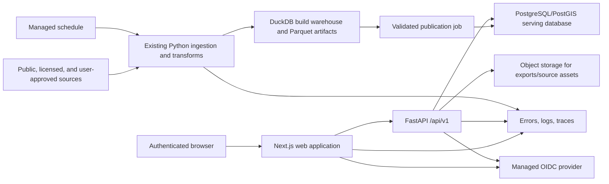

# Architecture decision

Decision: use Next.js/TypeScript for the web experience, Python/FastAPI for analytical services,
PostgreSQL/PostGIS for web serving and user state, and the existing Python/DuckDB project for
ingestion and reproducible analytical builds.

## Alternatives considered

Scores are relative (1 weak, 5 strong) for this product and team context.

| Criterion | Next.js + Python API + PostGIS | Next.js + TypeScript API + PostGIS | Python-first web app |
|---|---:|---:|---:|
| Initial development speed | 4 | 4 | 5 |
| Reuse of current analytical code | 5 | 2 | 5 |
| Long-term frontend maintainability | 5 | 5 | 2 |
| Geospatial serving | 5 | 5 | 3 |
| Dense interactive visualization | 5 | 5 | 2 |
| Financial/numerical modeling | 5 | 3 | 5 |
| Independent scaling | 5 | 5 | 2 |
| Authentication ecosystem | 5 | 5 | 3 |
| Scheduled refresh integration | 5 | 4 | 4 |
| Testability | 5 | 5 | 3 |
| Low operational complexity | 3 | 4 | 5 |
| Long-term extensibility | 5 | 5 | 2 |

### Option A — selected

Next.js owns routing, rendering, interaction, and server-side session boundaries. FastAPI owns
domain services for area querying, score explanations, spatial data, and later financial models.
PostGIS is the online query store. The split adds one service boundary, but it preserves the tested
Python data/model domain and allows a first-class React analytical UI.

### Option B — all TypeScript

A Next.js application with a TypeScript API is operationally simpler and shares types end to end,
but it would duplicate or port existing Python transformations and future numerical work. It is a
good alternative if the Python analytical layer is intentionally retired; that is not justified.

### Option C — Python-first

FastAPI plus server templates, Streamlit, or Dash would ship a prototype quickly, but the requested
map/table synchronization, accessible dense interactions, URL state, property review on mobile,
and long-lived product architecture would be harder to maintain. The existing small WSGI dashboard
remains useful for diagnostics, not as the product shell.

## Selected stack

| Layer | Selection | Rationale |
|---|---|---|
| Web | Next.js App Router, React, strict TypeScript | Mature routing/rendering, accessible component composition |
| UI primitives | Radix primitives plus application-owned design tokens | Accessible behavior without a generic dashboard aesthetic |
| Forms/contracts | React Hook Form and Zod; generated OpenAPI client | Input validation and contract drift control |
| Remote/query state | TanStack Query; URL search parameters | Cache server responses; make filters shareable |
| Tables | TanStack Table with server pagination/sorting | Dense, customizable analytical tables |
| Charts | Observable Plot or lightweight D3 modules | Explainable charts without a heavyweight dashboard runtime |
| Map | MapLibre GL JS | Open client, vector-tile capable, property clustering |
| API | FastAPI, Pydantic v2, SQLAlchemy 2/SQLModel-free repositories | Reuses Python domain work; strict boundary validation |
| Serving database | PostgreSQL 16 + PostGIS | Spatial indexes, relational integrity, user state, vector tiles |
| Analytical build | Existing Python 3.11/DuckDB pipeline | Reproducible ingestion, source lineage, Parquet publication |
| Jobs | Scheduled container/managed cron plus durable `job_run` table | Enough for refresh jobs; no broker initially |
| Object storage | S3-compatible bucket only for immutable source assets/exports | Avoid database blobs; introduce when deployed |
| Observability | Structured JSON logs, OpenTelemetry-compatible traces, Sentry | Errors, latency, job correlation |
| Packaging | Docker for API/jobs; reproducible web build | Environment parity and deployment portability |

Redis is deliberately deferred. First use SQL indexes, materialized serving tables, ETags, short
HTTP cache headers, and client query caching. Add Redis only if profiling shows repeated expensive
queries that cannot be addressed safely with those tools.

## System topology

The publisher is an explicit boundary: it validates schema/version, loads a staging set, runs
quality checks, and atomically activates a release. Failed refreshes leave the prior serving
release available.

## Frontend architecture

- Route groups separate authenticated application pages from sign-in and public legal pages.
- Feature modules (`opportunity`, `area-detail`, `strategies`, `saved`) own views and view models.
- Generated API types are the only network DTOs. Domain presentation functions convert explicit
  units/dates into display values.
- A single normalized `ScreenerQuery` controls URL, filter form, table, export, and map. Map viewport
  is query context, not a second filter store.
- Server components render shells and safe initial data; client components own map/chart/table
  interactions. Business formulas do not live in React components.
- Feature flags hide incomplete phases. No placeholder listings or scores appear in production.

## Backend architecture

- Routers parse versioned contracts and authorize workspace access.
- Services coordinate repositories, score calculators, source metadata, and exports.
- Repositories contain parameterized SQL and never accept raw sort/filter expressions.
- Domain modules implement typed scoring and, later, financial formulas.
- Publication jobs convert the existing analytics tables to serving releases.
- Error responses use stable codes, request identifiers, safe messages, and field details.
- Structured logs include request/job ID, route, latency, release ID, workspace ID where safe, and
  outcome; never API keys, raw tokens, financial notes, or licensed payloads.

## Authentication and authorization

Use a managed OpenID Connect provider with Authorization Code + PKCE. The web application stores
an opaque, rotated session in `HttpOnly`, `Secure`, `SameSite=Lax` cookies. The API validates
short-lived signed tokens by issuer, audience, signature, expiry, and nonce/session context.

Phase 1 roles are `owner`, `analyst`, and `viewer`; a single-user workspace still uses the same
authorization boundary. All user-owned rows carry `workspace_id`. Repository calls require an
authorized workspace context, and exports use short-lived signed URLs. Public registration is off
by default. A local development identity is allowed only in an explicit non-production environment.

## Spatial and caching strategy

- Persist valid PostGIS multipolygons and representative points with SRID 4326.
- Query by visible bounding box using GiST indexes; cap bounds, zoom, result count, and geometry
  complexity.
- Serve vector tiles with `ST_AsMVT`/`ST_AsMVTGeom` for national/city map use. Simplified geometries
  are zoom-tiered; detail fetches full geometry only when justified.
- Cluster property points server-side or with bounded client tiles in Phase 2.
- Cache immutable release-specific responses publicly within the private edge for short periods;
  cache user-specific responses privately or not at all.
- Include `release_id` and ETag. Activating a new release naturally changes cache keys.
- Financial calculations and user edits are never placed in a shared cache.

## Deployment

Recommended initial topology:

- Web: OpenAI Sites/Cloudflare-compatible deployment.
- API and job image: a small managed container platform close to the database.
- Database: managed PostgreSQL with PostGIS, point-in-time recovery, encrypted storage, private
  connection options, and separate staging/production instances.
- Objects: managed S3-compatible storage with private buckets and lifecycle rules.
- CI/CD: lint, type-check, unit, contract, integration, migration, build, dependency and secret
  scans; deploy staging; smoke test; manually promote production.

Migrations are forward-only and run as a distinct deployment step. A database release can roll
forward while the application rolls back to a compatible prior image. Data publication uses
release activation rather than destructive replacement.

Environment configuration is validated at startup. Secrets live in the deployment secret manager,
never `.env` files committed to source. Separate accounts, databases, keys, buckets, and identity
clients are used for development, staging, and production.

## Estimated operating cost

These are planning ranges, not vendor quotes; verify current prices before purchase.

| Stage | Web | API/jobs | PostGIS | Storage/tiles/monitoring | Monthly range |
|---|---:|---:|---:|---:|---:|
| Local development | $0 | $0 | $0–15 | $0 | $0–15 |
| Small internal pilot | $0–20 | $10–40 | $20–60 | $0–25 | $30–145 |
| Reliable small production | $10–30 | $40–120 | $60–180 | $20–100 | $130–430 |

Licensed property feeds, commercial map tiles, proprietary risk data, email/SMS volume, large
exports, and high-availability database replicas are excluded because their cost depends on later
decisions. Engineering time and legal/data-license review will exceed baseline infrastructure cost.

## Architecture decision record

- Status: proposed.
- Consequence: two application languages and one API boundary.
- Benefit: direct reuse of the current Python analytical platform plus a durable interactive UI.
- Revisit when: profiling shows the API boundary is a bottleneck, the team cannot support Python
  and TypeScript, or a vendor constraint changes hosting.
- Rejected for now: microservices by domain, Kafka, Kubernetes, Redis, GraphQL, a separate search
  cluster, and client-side national geometry. None is required for Phase 1.
